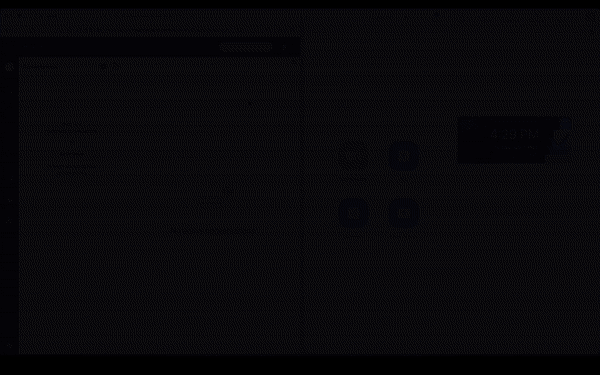
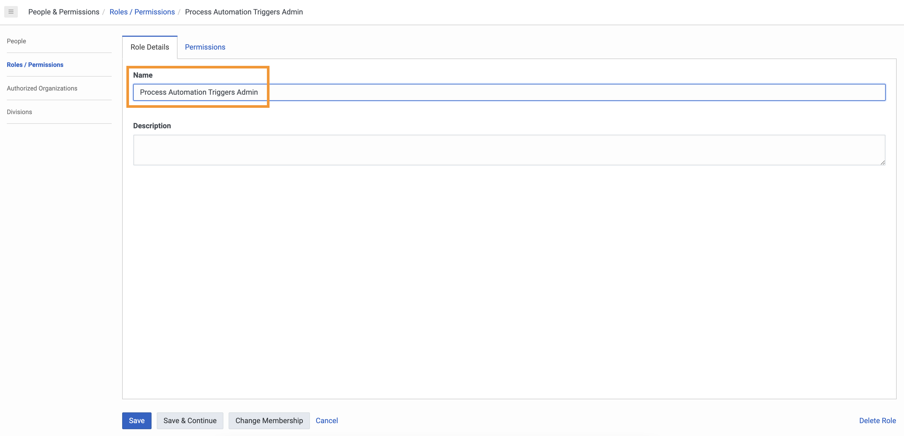
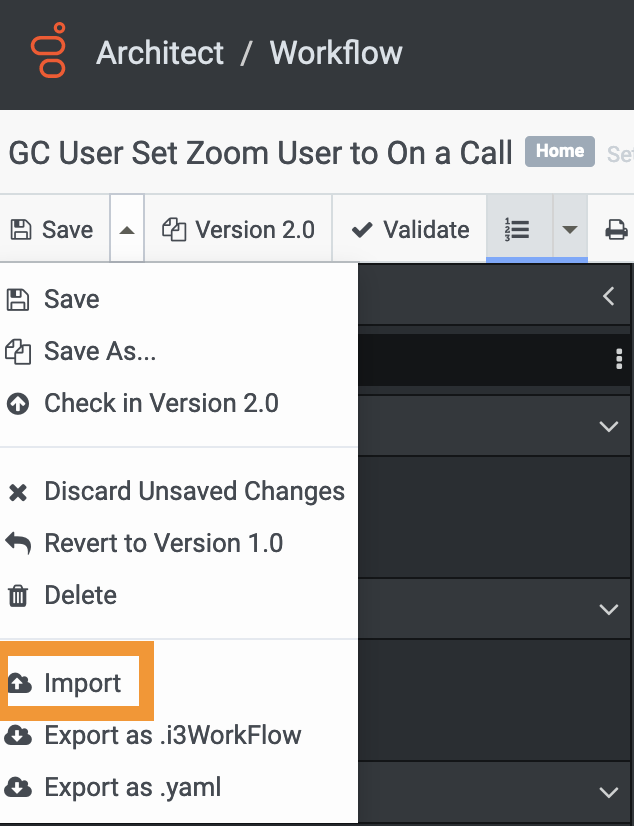
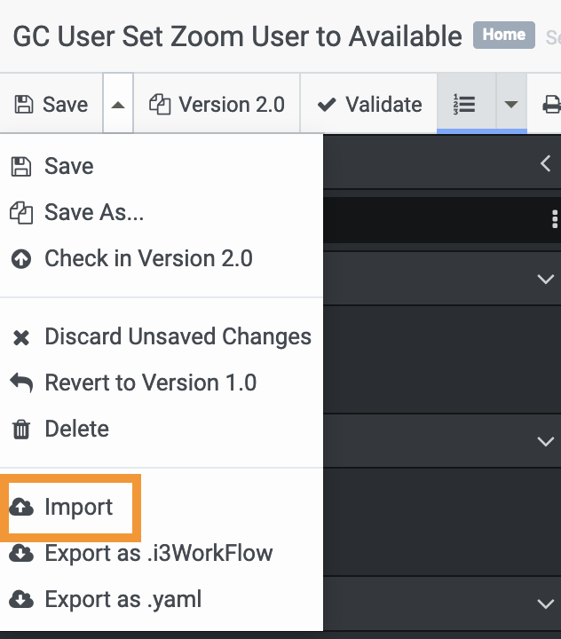
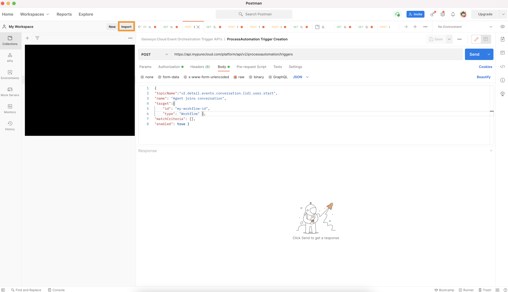
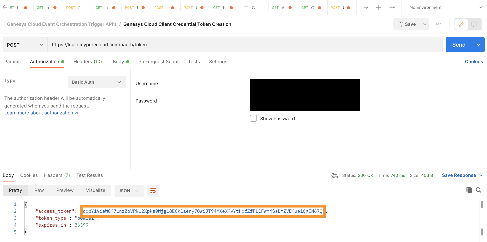
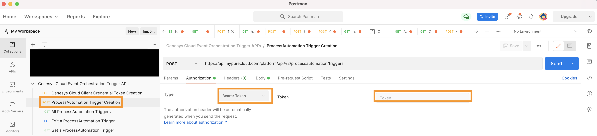

  This Genesys Cloud Developer Blueprint explains how to set up Genesys Cloud and Zoom for a Genesys Cloud agent's Zoom presence to be updated upon the start and end of an inbound Genesys Cloud voice interaction. When an architect workflow receives an inbound interaction, a Zoom API call will be sent to the Zoom user associated with the Genesys Cloud agent assigned to the interaction.  The Zoom user's presence will be set to "On a Call" when the voice interaction begins.  When the interaction ends, the Zoom user will be returned to "Available".
The following illustration shows the presence solution from an agent’s point of view.

The following shows the end to end agent experience this blueprint enables.

To enable Zoom presence updates to be triggered from Genesys Cloud, you use several public APIs that are available from Genesys Cloud and Zoom. The following illustration shows the API calls between Genesys Cloud and Zoom.

* [Solution components](#solution-components "Goes to the Solution components section")
* [Prerequisites](#prerequisites "Goes to the Prerequisites section")
* [Implementation steps](#implementation-steps "Goes to the Implementation steps section")
* [Additional resources](#additional-resources "Goes to the Additional resources section")

## Solution components
* **Genesys Cloud CX** - A suite of Genesys cloud services for enterprise-grade communications, collaboration, and contact center management. Contact center agents use the Genesys Cloud user interface.
* **Genesys Cloud API** - A set of RESTful APIs that enables you to extend and customize your Genesys Cloud environment. The Genesys Cloud API for agentless SMS notification sends the meeting information to the caller.
* **Zoom** - A virtual meeting and collaboration app. Zoom is the app that hosts the meeting for our solution.
* **Postman** - An API platform for using APIs.

## Prerequisites

### Specialized knowledge

* Administrator-level knowledge of Genesys Cloud
* Administrator-level knowledge of Zoom
* Experience with REST API authentication
* User-level knowledge of Postman

### Genesys Cloud account

* A Genesys Cloud 3 license. For more information, see [Genesys Cloud Pricing](https://www.genesys.com/pricing "Opens the pricing article").
* The Master Admin role in Genesys Cloud. For more information, see [Roles and permissions overview](https://help.mypurecloud.com/?p=24360 "Opens the Roles and permissions overview article") in the Genesys Cloud Resource Center.
* Event Orchestration must be activated for your Genesys Cloud org.

### Zoom

* An Enterprise Zoom account is required.  
* Admininstrator-level role to set up the required authorization and permissions for Genesys Cloud in Zoom.
* Zoom license for each agent

## Implementation steps
* [Configure the Zoom custom app](#configure-the-zoom-custom-app "Goes to the Configure the Zoom custom app section")
* [Configure Genesys Cloud](#configure-genesys-cloud "Goes to the Configure Genesys Cloud section")
* [Add a web services data actions integration](#add-a-web-services-data-actions-integration "Goes to the Add a web services data actions integration section")
* [Create an OAuth client for use with Postman](#create-an-oauth-client-for-use-with-postman "Goes to the Create an OAuth client for use with Postman")
* [Import the Update Zoom User Presence Action](#import-the-update-zoom-user-presence-action "Goes to the Import the Update Zoom User Presence Action section")
* [Import the Architect Workflows](#import-the-architect-workflows "Goes to the Import the Architect Workflows section")
* [Create the Event Orchestration Triggers](#create-the-event-orchestration-triggers "Create the Event Orchestration Triggers")
* [Additional resources](#additional-resources "Goes to the Additional resources section")

### Configure the Zoom custom app
To enable Genesys Cloud to authorize and retrieve user information from the Zoom API, register your custom application in Zoom.

1. Log in to the [Zoom App Marketplace](https://marketplace.zoom.us/ "Goes to the Zoom App Marketplace").
2. Hover over **Develop** and click **Build App**.

   

3. In the **JWT** box, click **Create**

   

4. Give your app a name, define the app type, and turn off Zoom App Marketplace publishing. Then click **Create**

5. Expand the **View JWT Token** section. Set **Expire in:** to **Other** and define your desired expiration date.

6. Click **Copy** to copy the JWT token.

   

### Configure Genesys Cloud

### Add a web services data actions integration
To enable communication from Genesys Cloud to Zoom, add a web services data actions integration.

1. In Genesys Cloud, install a web services data actions integration. For more information, see [Add a data actions integration](https://help.mypurecloud.com/?p=177879 "Opens the Add a data actions integration article").

   

2. Rename the web services data actions integration and provide a meaningful description.

   

3. Navigate to **Configuration** > **Credentials** and click **Configure**.

   

4. Under **Credential Type**, click **User Defined**. Then click **Add Credential Field**. In the Field Name box, type token. In the **Value** box, paste the JWT token that you obtained when you [configured your Zoom custom app](#configure-the-zoom-custom-app "Goes to the Configure the Zoom custom app section" ). Then click **OK**.

   

5. Activate the integration and click **Save**.  

### Create a custom role for use with Genesys Cloud OAuth client

1. Navigate to **Roles/Permissions**.

   

2. Type a **Name** for your custom role.

  

3. Search and select the **processautomation>trigger>All Permissions** permissions and click **Save** to assign the appropriate permissions to your custom role.

:::primary
**Note:** Assign this role to your user record before creating the Genesys Cloud OAuth client.  The processautomation>trigger>All Permissions requires Event Orchestration to be activated in your Genesys Cloud organization.
:::

  

### Create an OAuth client for use with Postman
To create the Event Orchestration triggers via Postman, you must have a Genesys Cloud OAuth client to authenticate with the Genesys Cloud Public API.

1. Navigate to **Integrations** > **OAuth** and click **Add Client**.

   

2. Enter a name for the OAuth client and select **Client Credentials** as the Grant Type. Click the **Roles** tab and assign the roles for the OAuth client.

   :::primary
   **Note:** Select a custom role that includes the permission Messaging > Sms > Send. No default role includes this permission. To create a custom role, see the Custom roles information in [Roles and permissions overview](https://help.mypurecloud.com/?p=24360 "Opens the Roles and Permission overview article").
   :::

   

3. Click **Save** and record the Client ID and Client Secret values for later use.

   

### Import the Update Zoom User Presence Action
This data action calls the Microsoft Graph API to update the Zoom user's presence.

1. Download the *Update-Zoom-User-Presence.custom.json* file from the [update-zoom-presence-from-inbound-interaction repo](https://github.com/jasonwolfg/update-zoom-presence-from-inbound-interaction- "Opens the GitHub repo") GitHub repository. Save this file in your local desktop to import it into Genesys Cloud.
2. Navigate to **Integrations** > **Actions** and click **Import**.

   

3. Select the *Update-Zoom-User-Presence.custom.json* file and associate with the web services data action you created in the [Add a web services data actions integration](#add-a-web-services-data-actions-integration "Goes to the Add a web services data actions integration section") section and click **Import Action**.

   

### Import the Architect Workflows
You need to import the *GC User Set Zoom to DoNotDisturb_v8-0.i3WorkFlow* and *GC User Set Zoom to Available_v4-0.i3WorkFlow* architect workflows that references the created data actions. These workflows will be called by the Event Orchestration triggers created in the next step.  When triggered, these workflows will call the Find Zoom User ID data action, set the Zoom User Id variable then update the Zoom user's presence via the Graph API.  One workflow is triggered with an agent joins an inbound acd voice interaction and sets the Zoom presence to DoNotDisturb.  The other workflow is triggered when the inbound acd interaction ends and sets the Zoom presence to Available.  

1. Download the *GC User Set Zoom to DoNotDisturb_v8-0.i3WorkFlow* file from the [update-zoom-presence-from-inbound-interaction](https://github.com/jasonwolfg/update-zoom-presence-from-inbound-interaction- "Opens the GitHub repo") GitHub repository. Save this file to your local desktop to import it into Genesys Cloud.  

2. Navigate to **Admin** > **Architect** > **Flows:Workflow** and click **Add**.

   

3. Name your workflow and click **Create**.

  

4. Expand the **Save** menu and click **Import**.

   

5. Select the downloaded *GC User Set Zoom to DoNotDisturb_v8-0.i3WorkFlow* file.  Click **Import**.

   

6. Review your workflow.  Copy the workflow ID from the URL and save it for the Event Orchestration Trigger creation.  Click **Save** then click **Publish**.

   

7. Download the *GC User Set Zoom to Available_v4-0.i3WorkFlow* file from the [update-zoom-presence-from-inbound-interaction](https://github.com/jasonwolfg/update-zoom-presence-from-inbound-interaction- "Opens the GitHub repo") GitHub repository. Save this file to your local desktop to import it into Genesys Cloud.  

8. Navigate to **Admin** > **Architect** > **Flows:Workflow** and click **Add**.

  

9. Name your workflow and click **Create**.

 

10. Expand the **Save** menu and click **Import**.

  

11. Select the downloaded *GC User Set Zoom to Available_v4-0.i3WorkFlowI’m * file.  Click **Import**.

  

12. Review your workflow.  Copy the workflow ID from the URL and save it for the Event Orchestration Trigger creation.  Click **Save** then click **Publish**.

  

## Create the Event Orchestration Triggers
With the workflows created, the last step is to create the triggers to call the workflows.  For this, you will need Event Orchestration activated in your Genesys Cloud organization and you will need Postman running on your machine to make the necessary API calls to create the necessary Event Orchestration triggers.

1. Download the *Genesys Cloud Event Orchestration Trigger API's.postman_collection.json* file from the [update-zoom-presence-from-inbound-interaction](https://github.com/jasonwolfg/update-zoom-presence-from-inbound-interaction- "Opens the GitHub repo") GitHub repository. Save this file to your local desktop to import it into Genesys Cloud.

2. Navigate to Postman and **Import**

   

3. Locate the *Genesys Cloud Event Orchestration Trigger API's.postman_collection.json* and click **Import**

   

4. Expand the **Genesys Cloud Event Orchestration API's** folder and select **Genesys Cloud Client Credential Token Creation**.  Be sure to change your API domain to match the AWS region your Genesys Cloud organization is hosted.  The GC org in this screenshot is hosted in us-east-1.  On the **Authorization** tab, paste the **Client ID** from your OAuth client created in [Create an OAuth client for use with the Genesys Cloud data action integration](#create-an-oauth-client-for-use-with-the-genesys-cloud-data-action-integration "Goes to the Create an OAuth client for use with the Genesys Cloud data action integration section") in the **Username** field in Postman.  Paste the **Client Secret** from the same OAuth client into the **Password** field in Postman.  Click **Send**.

   :::primary
   **Note:** For a list of the API prefixes for the Genesys Cloud Public API, [click-here](https://developer.genesys.cloud/platform/api/ "Open Genesys Cloud Developer Center")
   :::

  

5. Copy the **access token** from the body of the response.

     

6. Open **ProcessAutomation Trigger Creation**.  On the **Authenication** tab, select **Bearer Token** and paste the access token from the previous step.

     

7. Click the **Body** tab, Be sure to change your API domain to match the AWS region your Genesys Cloud organization is hosted.  Replace **my-workflow-id** with the id of the **GC User Set Zoom to DoNotDisturb** Architect workflow you created earlier in this blueprint.  Click **Send**.

   :::primary
   **Note:** For a list of the API prefixes for the Genesys Cloud Public API, [click-here](https://developer.genesys.cloud/platform/api/ "Open Genesys Cloud Developer Center")
   :::

    

8. The first trigger has been created.  To create the second one, change the **topicName** to **v2.detail.events.conversation.{id}.user.end**.  Replace **my-workflow-id** with the id of the **GC User Set Zoom to Available** Architect workflow you created earlier in this blueprint.  Click **Send**.

    

## Additional resources

- [Update Zoom Presence](https://marketplace.zoom.us/docs/api-reference/zoom-api/methods#operation/updatePresenceStatus "Opens the Zoom API documentation") in the Zoom API Reference
- [Supported Genesys Cloud Notification Triggers](https://developer.genesys.cloud/notificationsalerts/notifications/available-topics "Opens the Genesys Cloud API Explorer") in the Genesys Cloud Developer Center
